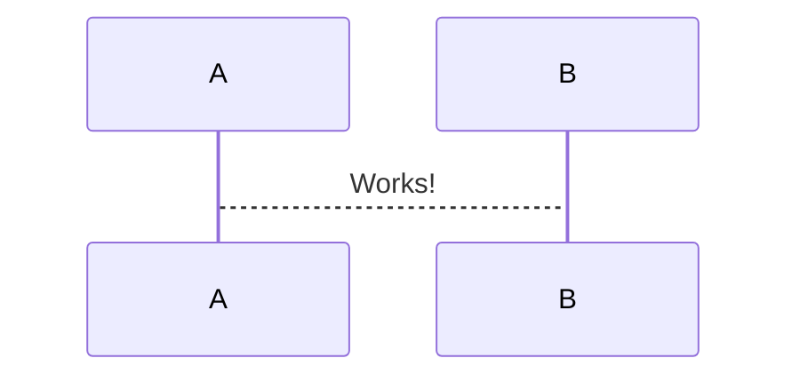

# Shining Sword Arena

https://maxwilson.github.io/Arena/

Proof of concept for Shining Sword arena. Rule system-agnostic presentation layer with terrain and animation support.

## Quick-start

```bash
npm i
npm start
start http://localhost:8080
```

## Requirements

* [dotnet SDK](https://www.microsoft.com/net/download/core) v7.0 or higher
* [node.js](https://nodejs.org) v18+ LTS


## Editor

To write and edit your code, you can use either VS Code + [Ionide](http://ionide.io/), Emacs with [fsharp-mode](https://github.com/fsharp/emacs-fsharp-mode), [Rider](https://www.jetbrains.com/rider/) or Visual Studio.


## Deployment

To build the application and make ready for production:
```
npm run build
```
This command builds the application and puts the generated files into the `dist` directory (can be overwritten in vite.config.js). This is done automatically on github after checkin.

# Attributions

Sword icon created by pongsakornRed - Flaticon. https://www.flaticon.com/free-icons/sword

Sword icons created by Freepik - Flaticon. https://www.flaticon.com/free-icons/sword

Shield icons created by Freepik - Flaticon. https://www.flaticon.com/free-icons/sword



::: mermaid
stateDiagram-v2
  state "Shining Sword" as flow {
    [*] --> Autofight
    [*] --> Adventure
    state Autofight {
        [*] --> Setup
        SpecificFight: Specific Fight
        Setup --> SpecificFight: Run specific fight once
        Setup --> Calibrated: Run N times <br>to find N <br> fitting specified <br>victory %
        SpecificFight --> [*]
        Calibrated --> [*]
    }
    state Adventure {
      ChooseParty: Choose PCs and allies
      ChooseOpposition: Choose enemies
      [*] --> ChooseParty
      ChooseParty --> ChooseOpposition
      ChooseParty --> ChooseAdventure
      ChooseOpposition --> SetupEncounter
      SetupEncounter: Set up positions, behaviors
      SetupEncounter --> Execute
      Execute --> AwardTreasure
      AwardTreasure --> SaveProgress: Keep results
      AwardTreasure --> [*]: Discard results
      SaveProgress --> [*]
    }
  }
:::